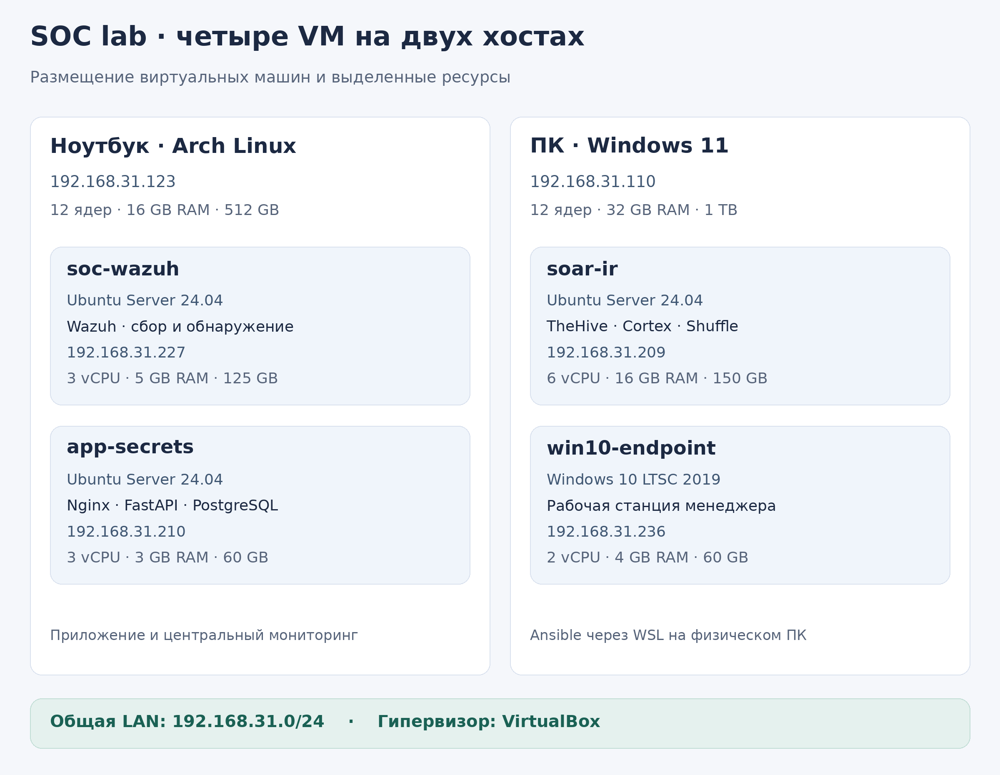
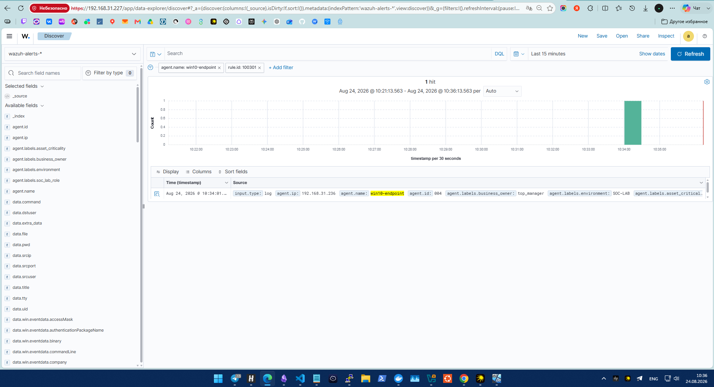
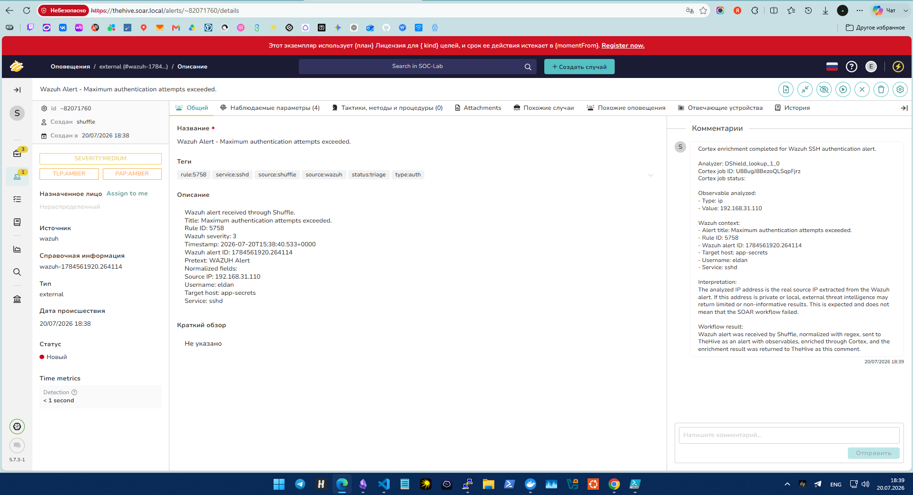
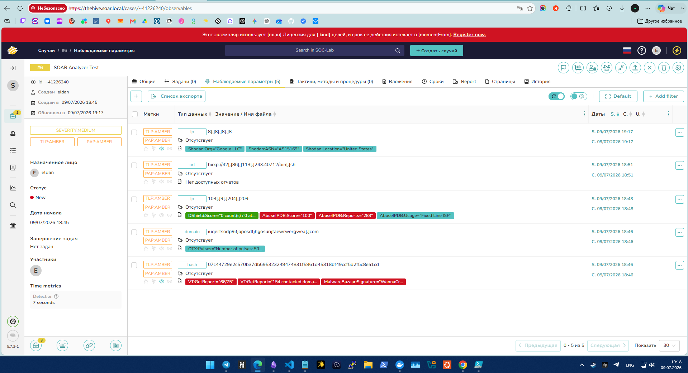

# SOC lab — практика в ИБ и SOC

Я построил учебную SOC-лабораторию для практики в информационной безопасности: настройки защиты, мониторинга событий, обнаружения атак и работы с оповещениями.

## Архитектура

| Узел             | Состав и назначение                                          |
| ---------------- | ------------------------------------------------------------ |
| `soc-wazuh`      | Ubuntu Server 24.04; Wazuh Manager, Indexer и Dashboard      |
| `app-secrets`    | Ubuntu Server 24.04; собственный сервис управления секретами |
| `soar-ir`        | Ubuntu Server 24.04; TheHive, Cortex и Shuffle               |
| `win10-endpoint` | Windows 10 LTSC 2019; Sysmon, Wazuh Agent, Defender          |

Я разместил четыре VM на двух физических хостах и использовал Ansible через WSL для управления Linux и Windows.

## Что я реализовал

- Собрал лабораторию из четырёх виртуальных машин.
- Реализовал в составе проекта отдельный собственный [сервис управления секретами](https://github.com/A-R-M-O-R/Secret-manage-service).
- Связал Ansible с сервисом для получения четырёх паролей управления узлами.
- Подготовил защищённую Ubuntu для `app-secrets` и создал из неё `soar-ir`.
- Выполнил мягкое усиление Windows и настроил телеметрию конечной точки.
- Подключил системные события и JSON-журнал Nginx к Wazuh.
- Настроил правила обнаружения и четыре сценария обработки в Shuffle и TheHive.
- Подключил семь анализаторов Cortex и создал четыре пользовательских дашборда Wazuh.

## Четыре сценария атак

| Сценарий                          | Обнаружение                               | Результат                                                                   |
| --------------------------------- | ----------------------------------------- | --------------------------------------------------------------------------- |
| Локальный подбор пароля Windows   | 100301; три неудачных входа за 120 секунд | Alert в TheHive, без Cortex                                                 |
| Подбор SSH-пароля к `app-secrets` | 5758                                      | Alert, вызов DShield и комментарий                                          |
| Подбор пароля API                 | 100401; повторные HTTP 401                | Alert создан; добавление комментария ограничено истечением лицензии TheHive |
| Перебор путей секретов            | 100411; повторные HTTP 403/404            | Alert создан; добавление комментария ограничено истечением лицензии TheHive |

[Схема Shuffle и разбор четырёх сценариев](docs/05-attack-scenarios.md).

## Основные результаты

| Направление                   | Мой результат                                                                                   |
| ----------------------------- | ----------------------------------------------------------------------------------------------- |
| SCA `app-secrets` и `soar-ir` | 73% на каждом узле                                                                              |
| SCA Windows                   | 35% → 45%                                                                                       |
| Обработка событий             | Получил Alerts в TheHive для четырёх выбранных сценариев                                        |
| Cortex                        | Проверил семь анализаторов; после истечения ключа Shodan продолжаю использовать остальные шесть |
| Сервис секретов               | Использую четыре пароля Ansible через API и права чтения                                        |

## Примеры работы

**Обнаружение локального подбора пароля в Wazuh.**

**SSH-оповещение и комментарий Cortex в TheHive.**

**Результаты анализаторов для тестовых индикаторов.**

[Все скриншоты с пояснениями](evidence/README.md).

## Основные технологии

- Мониторинг: Wazuh 4.9.2, Sysmon, Microsoft Defender.
- Обработка оповещений: TheHive 5.7.3, Cortex 4.0.1, Shuffle.
- Управление: Ansible, Python, SSH, WinRM.
- Среда: Ubuntu Server 24.04, Windows 10 LTSC 2019, VirtualBox, Docker.
- Приложение: Nginx, FastAPI, PostgreSQL, Fernet, JWT.
- Хранилища SOAR: Cassandra, Elasticsearch, OpenSearch.

## Что можно улучшить и доработать

Я вижу следующие направления развития лаборатории. Эти задачи оставляю за пределами завершённого объёма проекта.

1. **Контролировать доступность агентов.** Настроить оповещения об остановке Wazuh Agent и прекращении поступления событий, затем проверить их тестовым отключением.
2. **Сделать сценарии устойчивее к сбоям.** Добавить обработку тайм-аутов, недоступных API и лимитов запросов, повторные попытки и защиту от дублирования оповещений.
3. **Проверить качество правил.** Подготовить набор атакующих и обычных событий, измерить ложные срабатывания и подобрать пороги без потери нужных событий.
4. **Добавить управляемое реагирование.** Начать с блокировки тестового адреса после подтверждения аналитиком, с ограничением времени и возможностью отмены.
5. **Разделить сетевой доступ.** Выделить сегменты управления, приложения и конечной точки, затем явно разрешить необходимые соединения между ними.
6. **Сократить поверхность доступа.** Пересмотреть правила UFW: в сохранённом замере приложения есть разрешение SSH от любых адресов, хотя рядом присутствует более узкое правило для LAN. Ограничить также доступ к webhook Shuffle.
7. **Усилить проверку соединений.** Настроить доверенные сертификаты, включить проверку TLS при получении секретов, проверку ключей SSH-хостов и защищённое подключение WinRM.
8. **Перевести SSH-подключения на аутентификацию по ключам.**

## Где читать подробнее

| Раздел                                                                   | Что я описал                                              |
| ------------------------------------------------------------------------ | --------------------------------------------------------- |
| [Архитектура](docs/01-architecture.md)                                   | Размещение, ресурсы, адреса и соединения                  |
| [Развёртывание и защита](docs/02-deployment-and-hardening.md)            | Создание VM, CIS, Windows и решённые проблемы             |
| [Сервис секретов и Ansible](docs/03-secret-service-and-ansible.md)       | Приложение и получение паролей                            |
| [Мониторинг](docs/04-monitoring-and-detection.md)                        | Журналы, FIM, SCA, правила и дашборды                     |
| [Сценарии атак](docs/05-attack-scenarios.md)                             | Тесты и схема обработки Shuffle                           |
| [Результаты](docs/06-results-and-evidence.md)                            | Измерения и иллюстрации                                   |
| [Воспроизведение и ограничения](docs/07-reproduction-and-limitations.md) | Порядок сборки и границы проекта                          |
| [SOAR: устройство и сохранённые настройки](soar-ir/README.md) | TheHive, Cortex, Shuffle и конфигурация Nginx |
| [Текстовые проверки состояния](evidence/reports/README.md) | Замеры Linux и Windows с пояснениями |
| [Каталог Ansible](ansible/README.md)                                     | Inventory, переменные, плагин и скрипт настройки секретов |

Код готового приложения я разместил в [A-R-M-O-R/Secret-manage-service](https://github.com/A-R-M-O-R/Secret-manage-service). В `soc-lab-docs` я собрал отчёт, иллюстрации, сохранённые материалы Ansible и раздел SOAR.

Я завершил построение лаборатории на выбранном объёме. Автоматическое сдерживание атак и отдельное восстановление баз данных в него не вошли. Для резервирования я использовал снимки VM.
