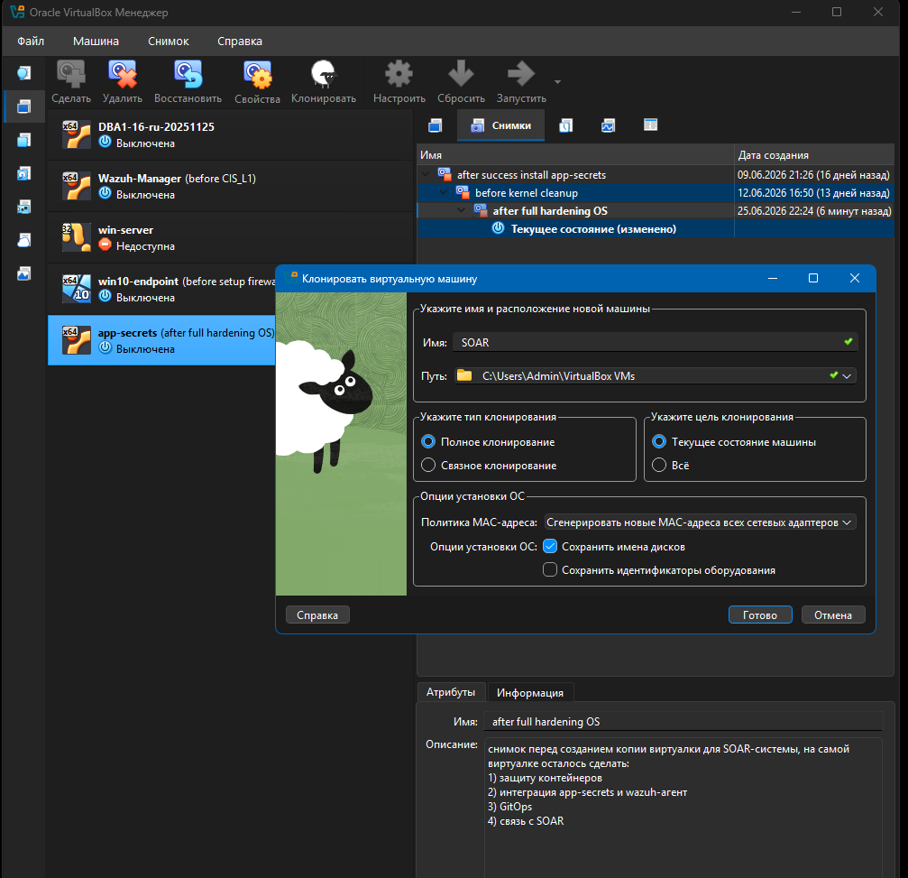
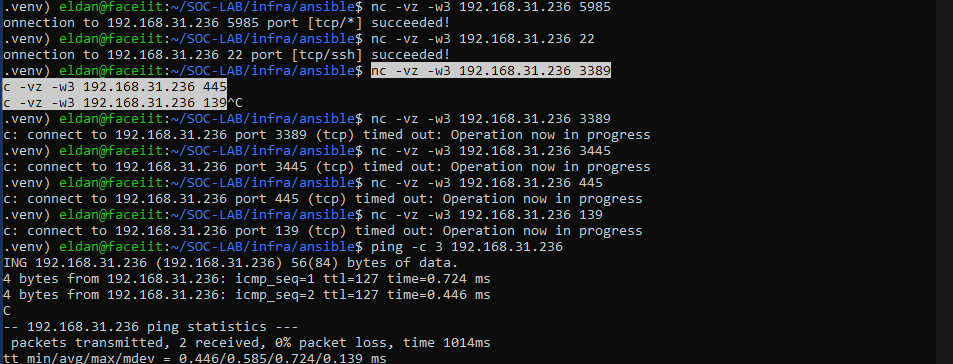
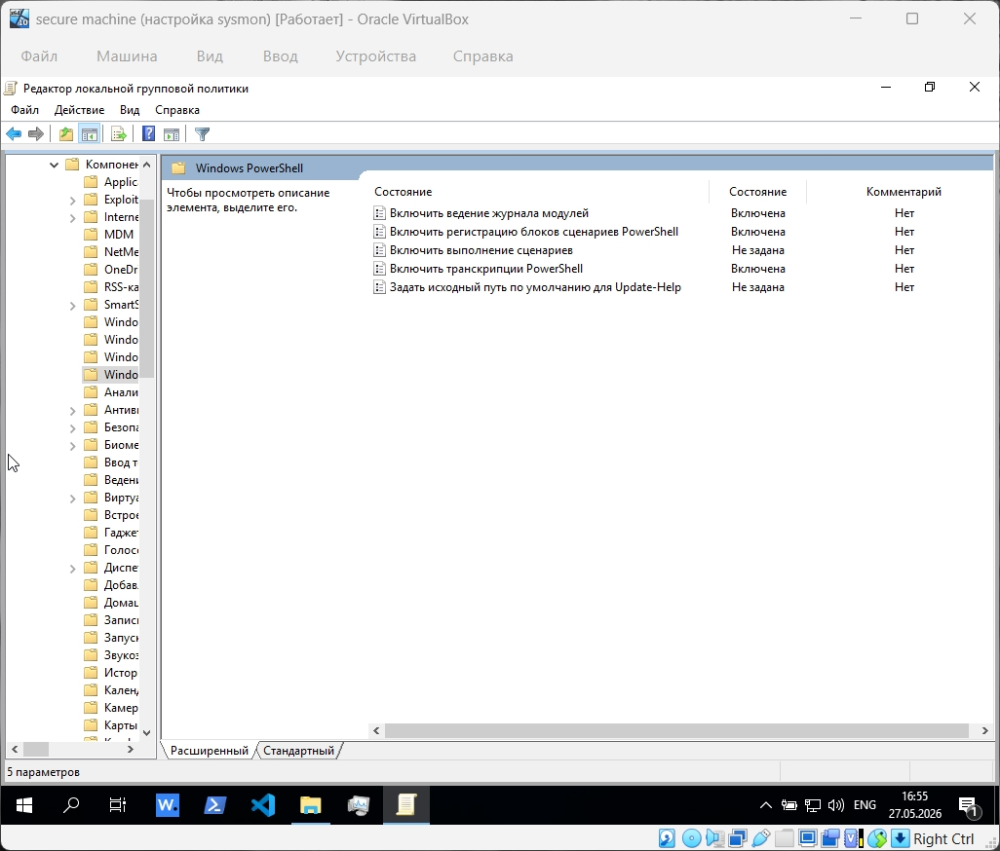
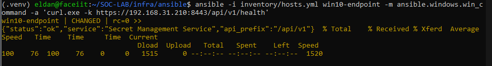
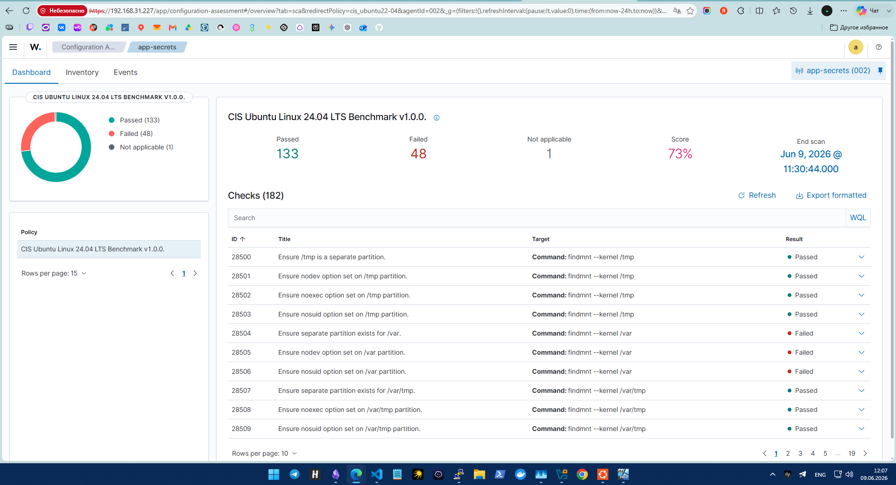

# 2. Развёртывание и усиление систем

[Главная страница](../README.md)

## Создание машин

Я установил чистую Ubuntu Server 24.04, подготовил на её основе `app-secrets` и выполнил усиление конфигурации. Из готовой защищённой VM я клонировал `soar-ir` для размещения TheHive, Cortex и Shuffle.

Центральный Wazuh я разместил отдельно и не применял к нему CIS L1, чтобы не нарушить работу уже действующего узла. Для Windows использовал мягкое усиление.

| Узел             | Что я применил                  | SCA       |
| ---------------- | ------------------------------- | --------- |
| `app-secrets`    | CIS L1 и точечные доработки     | 73%       |
| `soar-ir`        | Защищённая основа `app-secrets` | 73%       |
| `soc-wazuh`      | CIS L1 не применял              | 39%       |
| `win10-endpoint` | Мягкое усиление                 | 35% → 45% |

## Управление и statecheck

На Linux я использовал SSH, на Windows — WinRM по HTTP/5985. Для управления всеми четырьмя узлами использовал учётную запись `ansible`.

Через statecheck я проверял состояние служб, сетевые параметры и настройки безопасности. После изменений проверял управляющий доступ, связь агента с Wazuh и доступность приложения.

На снимке я проверяю доступность TCP 5985 и 22 с управляющей машины. Для ряда других портов подключения завершаются по тайм-ауту.

## Усиление Linux

Для Ubuntu я использовал готовую роль CIS L1. Затем дорабатывал отдельные параметры по результатам SCA и проверял, сохраняется ли работа необходимых сервисов.

В результате я получил 73% SCA на приложении и SOAR. В конфигурации оставил исключения, необходимые для Docker и удалённого управления.

### Проблемы и решения

**Временные файлы Ansible.** При изменении `/tmp` нарушалось выполнение временных модулей. Я перенёс рабочий временный каталог в `~/.ansible/tmp`.

**Связь агента с Wazuh.** Ограничения исходящего трафика затрагивали передачу событий. Я корректировал правила доступа с учётом адреса Manager и порта 1514.

**Доступ по SSH.** После ограничений пользователей и групп я проверял возможность входа и согласовывал разрешённые учётные записи.

После исправлений я проверил работу auditd и Wazuh Agent  на приложении.

## Мягкое усиление Windows

Я настроил:

- Wazuh Agent и Sysmon.
- Журналирование PowerShell и аудит создания процессов с командной строкой.
- Microsoft Defender и ASR с режимами аудита и блокировки.
- Windows Firewall с сохранением управляющего доступа.
- UAC и параметры защиты учётных данных.
- Отключение SMBv1, Guest, LLMNR, AutoRun и ряда удалённых функций.
- FIM для выбранных файлов, каталогов и ключей реестра.

Блокировку учётных записей после неудачных входов я оставил отключённой, чтобы сохранить лабораторное управление. Полную роль CIS для Windows в качестве завершённого результата не использовал.

## Проверка приложения после настройки

С Windows я проверил доступность API secret manage service через HTTPS. На снимке показан успешный ответ `/api/v1/health`.

## Результаты SCA

На приложении и SOAR я получил по 133 пройденные проверки, 48 непройденных и одной неприменимой. Для Windows использовал пару замеров 35% → 45%.

[Все замеры и скриншоты SCA](06-results-and-evidence.md).

[Далее: сервис секретов и Ansible](03-secret-service-and-ansible.md)
