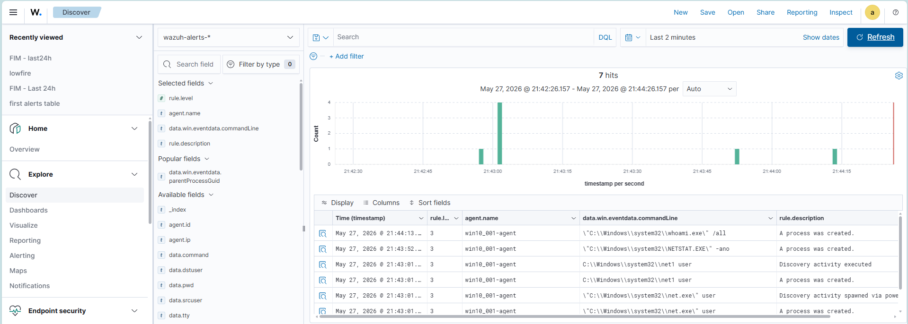
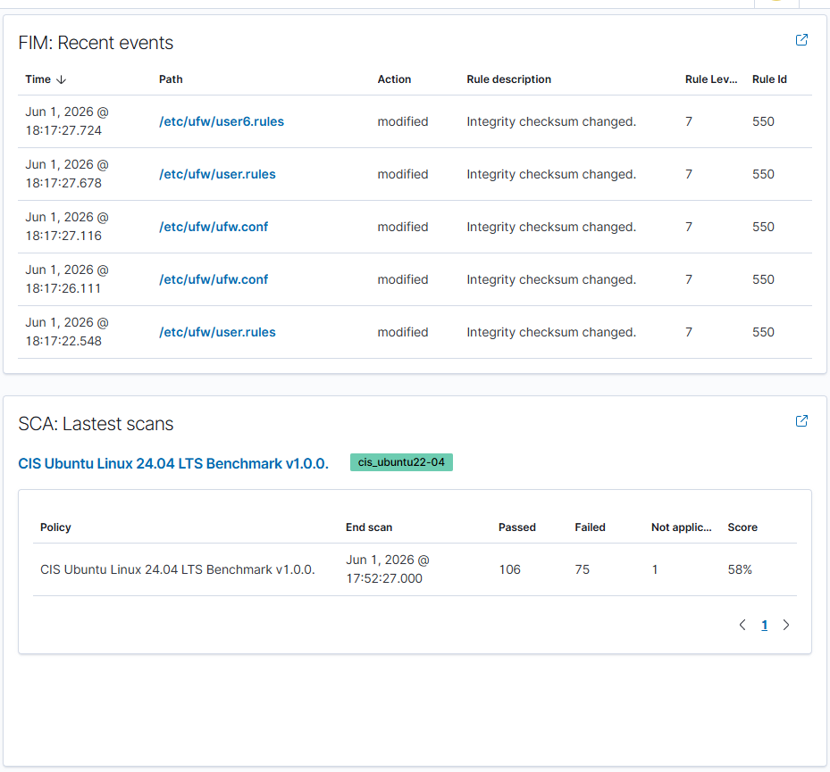

# 4. Мониторинг и обнаружение

[Главная страница](../README.md)

## Источники Wazuh

Я использовал Wazuh Manager 4.9.2 и подключил агенты к `192.168.31.227:1514/TCP`.

| Узел          | Что я подключил                                                                                         |
| ------------- | ------------------------------------------------------------------------------------------------------- |
| Windows       | Security, System, Application, Sysmon, PowerShell, Defender, WinRM и другие выбранные каналы; FIM и SCA |
| `app-secrets` | Системные события Linux, аутентификация, JSON Nginx, FIM, SCA и инвентаризация                          |
| `soar-ir`     | Агентский мониторинг ОС и SCA                                                                           |
| `soc-wazuh`   | Локальное наблюдение центрального узла                                                                  |

Отдельные PostgreSQL и прикладные журналы SOAR я не собираю.

## Windows

Я установил Sysmon и Wazuh Agent, включил журналирование PowerShell и аудит процессов с командной строкой. При первых тестах проверял поступление команд `whoami`, `netstat` и `net user` в Discover.

Снимок относится к раннему этапу настройки: агент на нём ещё имеет прежнее имя.

Для FIM я выбрал системные пути, элементы автозапуска, отдельные ключи реестра и каталог `C:\Users\manager\Desktop\TOP_MANAGER_SECRETS`. Управляющая учётная запись Ansible — `ansible`; имя `manager` в этом пути относится к пользовательскому сценарию рабочей станции.

## Linux и Nginx

Я подключил journald, `auth.log`, `dpkg.log` и JSON-журнал приложения. Для системных каталогов настроил FIM.

На снимке Wazuh показывает изменение файлов `/etc/ufw/`. Ниже виден промежуточный SCA; итоговый результат приложения — 73%.

Для API-атак я использовал `/var/log/secret-service/nginx/access_wazuh.json`. В событии получаю `service`, `event_type`, `srcip`, `method`, `uri`, `status`, `user_agent` и `request_id`.

## Правила обнаружения

| Сценарий               | Базовое правило | Итоговое правило | Условия                                                          |
| ---------------------- | --------------: | ---------------: | ---------------------------------------------------------------- |
| Локальный вход Windows |          100300 |           100301 | 4625, тип входа 2; три события одного пользователя за 120 секунд |
| SSH к приложению       | Штатные правила |             5758 | Ошибки SSH-аутентификации выбранного теста                       |
| Подбор пароля API      |          100400 |           100401 | POST входа, HTTP 401; пять событий одного IP за 120 секунд       |
| Перебор путей секретов |          100410 |           100411 | HTTP 403/404 сервиса; пять событий одного IP за 120 секунд       |

Для собственных корреляционных правил я использовал уровень 10. Параметр `ignore` — 120 секунд для 100301 и 60 секунд для 100401/100411. Для подбора паролей указал T1110, для поиска секретов — T1552.

В Windows-условии я выделил ошибки `User32` со статусом `0xc000006d` и подстатусом `0xc000006a`. Базовые правила с уровнем 1 и `no_log` использовал для последующей корреляции.

Правило 100410 выделяет ответы 403/404 сервиса. Отдельную проверку пути `/api/v1/secrets/*` и факта аутентификации в этом условии я не реализовал. Поэтому оно может сработать и на другие повторные ошибки доступа к этому сервису.

## Дашборды и дополнительные тесты

Я создал четыре дашборда:

- Аутентификация и доступ.
- Целостность файлов и конфигурации.
- События конечных точек и вредоносная активность.
- Сетевые и веб-события.

Их готовые конфигурации я не сохранил для переноса.

Дополнительно я проверял подозрительные конструкции PowerShell: EncodedCommand, IEX и другие команды. Для них наблюдал штатные правила Wazuh. Отдельную завершённую SOAR-ветку этих тестов в итоговый объём не включал.

[Далее: сценарии атак](05-attack-scenarios.md)
