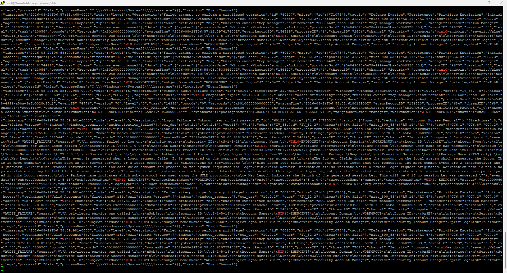
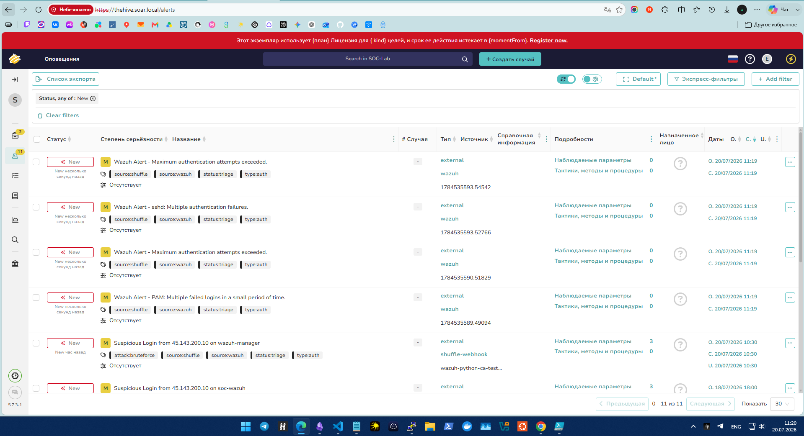
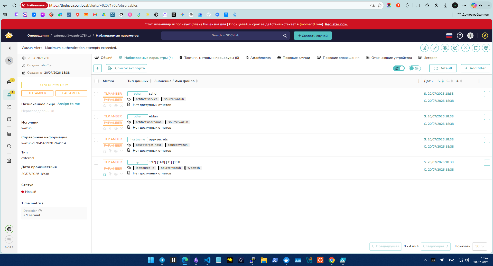
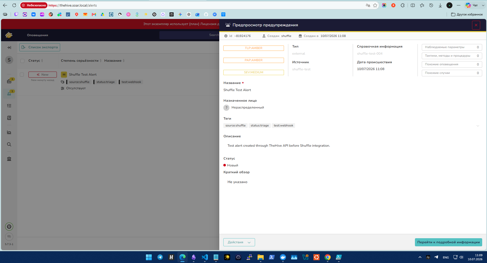
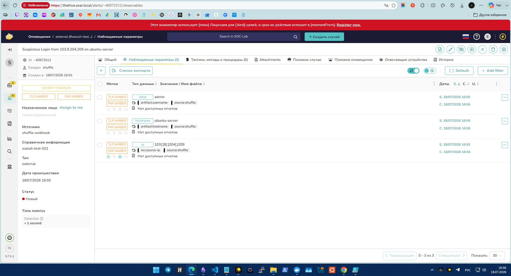
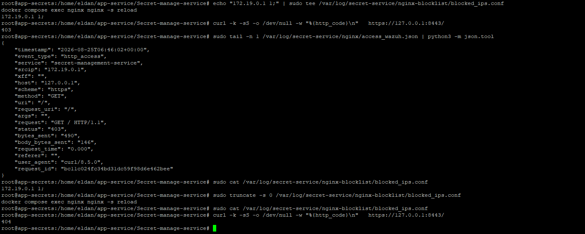

# 5. Сценарии атак и Shuffle

[Главная страница](../README.md)

Я проверил четыре сценария: локальный подбор пароля Windows, SSH к приложению, подбор пароля API и перебор путей секретов. Для каждого получил оповещение в TheHive.

## Схема сценария Shuffle

На схеме я показал переходы из экспортированного JSON: входящий webhook, выбор правила и три ветки. Общая API-ветка после обогащения разделяется на два типа Alert. Каждому действию экспорта соответствует отдельный блок; повторяющиеся технические имена заменены понятными подписями.

Для этой схемы я сохранил порядок API-действий из JSON: AbuseIPDB, OTXQuery, создание Alert, комментарий. Схема описывает структуру файла, а результат последних тестов я фиксирую отдельно ниже.

## 1. Локальный подбор пароля Windows

На локальной консоли я выполнял неудачные попытки входа. Агент передавал события Security 4625 с типом входа 2 в Wazuh. Правилом 100301 я выделял три неудачи одного пользователя за 120 секунд.

В Shuffle я извлекал пользователя, узел, тип входа и число ошибок, затем создавал Alert. Cortex в этой ветке не использовал: для локального входа нет внешнего адреса для репутационного анализа.

**Результат:** получил Alert в TheHive.

## 2. Подбор SSH-пароля

Я выполнял неудачные SSH-подключения к `app-secrets`. Для обработки использовал правило Wazuh 5758. В TheHive передавал IP источника, пользователя, имя узла и сервис.

В SSH-ветке я сначала создавал Alert, затем вызывал DShield через Cortex и добавлял комментарий.

**Результат:** получил Alert, observables и комментарий. На сохранённом снимке поле статуса задания в комментарии пусто. Для отдельной проверки самого анализатора я использовал публичные тестовые индикаторы.

## 3. Подбор пароля API

Я отправлял неверные данные на `POST /api/v1/auth/login`. Nginx записывал HTTP 401, а Wazuh выделял серию правилом 100401: пять событий одного IP за 120 секунд.

В ветке приложения я предусмотрел AbuseIPDB и OTXQuery, создание Alert и комментарий с обогащением.

**Результат:** Alert создан успешно. После истечения лицензии TheHive в моей установке добавление комментария стало недоступно. Поэтому в последнем API-тесте я получил Alert без комментария; это ограничение лицензии относится к завершающему действию.

## 4. Перебор путей секретов

Я проверял повторные обращения к путям секретов с ответами 403/404. Правило 100410 выделяло ошибки, а 100411 сопоставляло пять событий от одного IP за 120 секунд.

После исправления связи правил я получил итоговый Alert. Для обогащения использовал ту же API-ветку с AbuseIPDB и OTXQuery.

**Результат:** Alert создан успешно. Добавление комментария в последнем тесте было ограничено истечением лицензии TheHive, как и в сценарии подбора пароля API.

В условии 100410 я проверяю коды ответа сервиса. Точную фильтрацию только авторизованного перебора путей в этом правиле не реализовал.

## Промежуточные проверки интеграции

Перед основными тестами я проверил создание оповещения через API TheHive и передачу динамических observables из Shuffle.

На втором снимке я использовал тестовые значения пользователя, узла и IP для проверки подстановки полей.

## Ручная блокировка в Nginx

Я отдельно проверил список запрещённых адресов Nginx. В показанном тесте запрос к `/` получил 403 при активной блокировке; после удаления записи — 404 для этого пути.

Автоматическую блокировку через Shuffle/Wazuh я в итоговые сценарии не включал.

[Далее: результаты](06-results-and-evidence.md)
