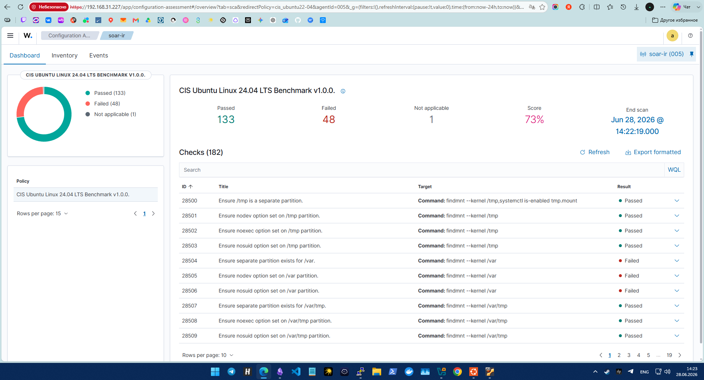
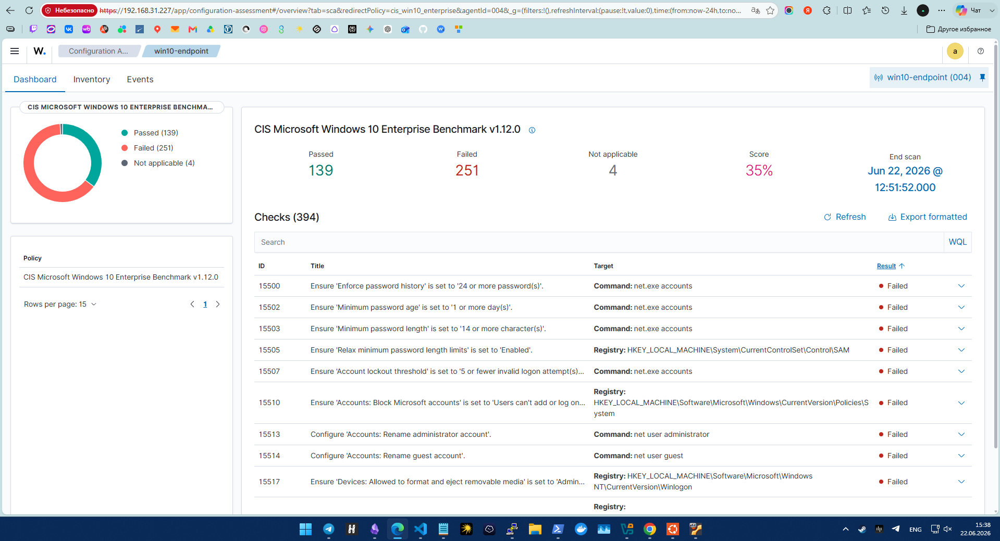
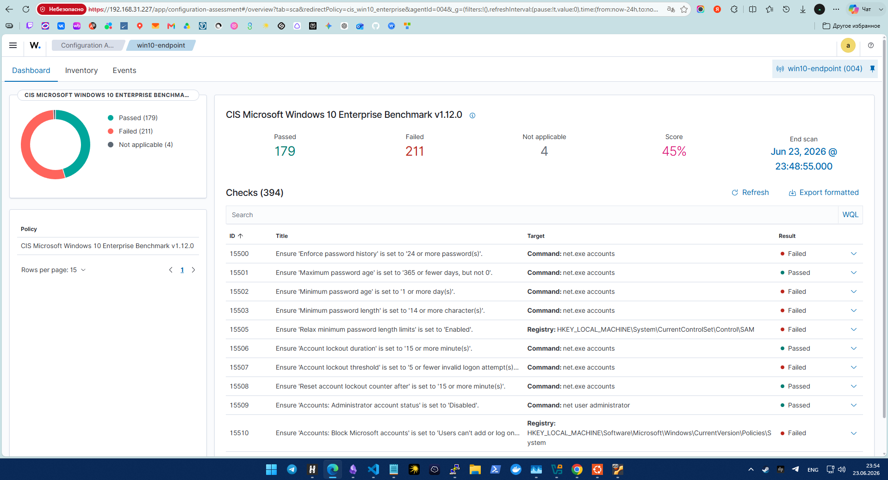
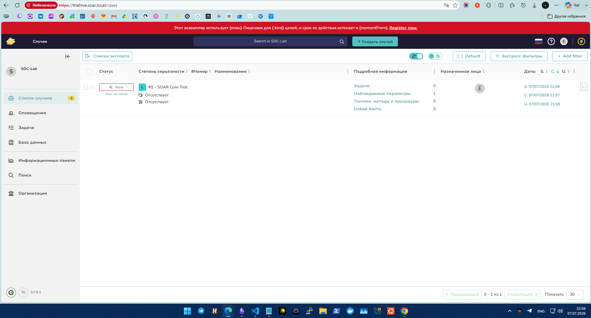
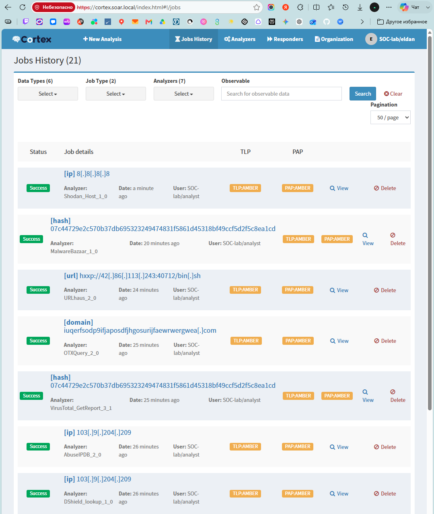
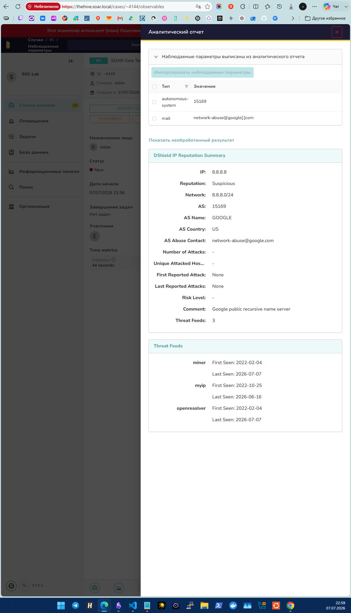

# 6. Результаты лаборатории

[Главная страница](../README.md) · [Все скриншоты](../evidence/README.md)

## Оценка конфигурации

| Узел          | Мой результат SCA       |
| ------------- | ----------------------- |
| `app-secrets` | 73%                     |
| `soar-ir`     | 73%                     |
| `soc-wazuh`   | 39%; CIS L1 не применял |
| Windows       | 35% → 45%               |

На приложении и SOAR я получил по 133 пройденные проверки, 48 непройденных и одной неприменимой. На Windows число пройденных проверок выросло с 139 до 179, а оценка — на 10 процентных пунктов.

Я использовал оценку SCA для проверки конфигурации по политике. Оценку вероятности атаки по этим процентам не рассчитывал. Точное исходное значение Linux в сравнительную таблицу не включал.

## Обработка оповещений

Я получил Alerts по четырём выбранным сценариям. Для SSH также проверил передачу observables и комментария о DShield. В последних API-тестах комментарии были недоступны после истечения лицензии TheHive.

На более раннем этапе я проверял автоматическое создание Cases. В отчёте оставил пример тестового Case и результаты работы анализаторов с его объектами.

## Анализаторы Cortex

| Анализатор    | Результат моей первоначальной проверки | Текущее состояние |
| ------------- | -------------------------------------- | ----------------- |
| DShield       | Успешно                                | Работает          |
| AbuseIPDB     | Успешно                                | Работает          |
| MalwareBazaar | Успешно                                | Работает          |
| OTXQuery      | Успешно                                | Работает          |
| Shodan        | Успешно                                | Ключ истёк        |
| URLhaus       | Успешно                                | Работает          |
| VirusTotal    | Успешно                                | Работает          |

Для тестирования я использовал IP, URL, домены и хеши. На следующем снимке показаны метки и результаты, которые появились у observables в TheHive.

Адрес `8.8.8.8` я использовал как тестовый индикатор для проверки интеграции. Метку репутации на конкретном снимке не использую как доказательство вредоносности этого адреса.

## Мониторинг и приложение

Я подключил Windows-телеметрию, системные события Linux, FIM и журнал Nginx. Проверил доступность сервиса с Windows и чтение паролей через сервисную учётную запись Ansible.

Создал четыре пользовательских дашборда Wazuh. Их готовые конфигурации для переноса не сохранил.

## Резервирование и границы измерений

Для резервирования я сохранил снимки четырёх VM. Отдельное восстановление PostgreSQL и данных SOAR не испытывал.

Я не измерял MTTD, MTTR, долю ложных срабатываний и производительность под нагрузкой. 

[Далее: воспроизведение и ограничения](07-reproduction-and-limitations.md)
