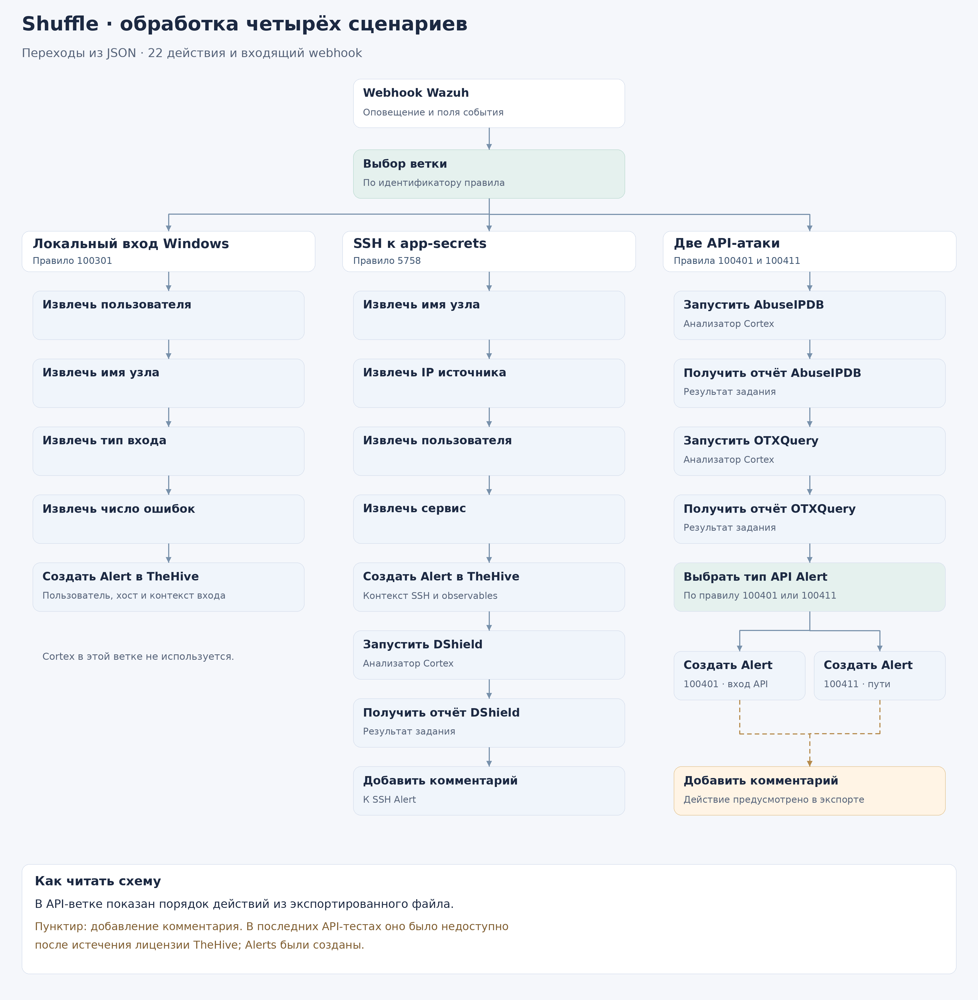

# SOAR-IR — обработка оповещений и обогащение событий

[Главная страница](../README.md) · [Архитектура лаборатории](../docs/01-architecture.md) · [Сценарии атак](../docs/05-attack-scenarios.md)

Я развернул на `soar-ir` TheHive, Cortex и Shuffle, чтобы практиковаться в обработке событий SOC: получать оповещения Wazuh, передавать контекст аналитику и проверять индикаторы через внешние источники.

## Узел

| Параметр   | Моя конфигурация                         |
| ---------- | ---------------------------------------- |
| ОС         | Ubuntu Server 24.04                      |
| Адрес      | `192.168.31.209`                         |
| Ресурсы VM | 6 vCPU, 16 GB RAM, диск 150 GB           |
| Размещение | VirtualBox на физическом ПК с Windows 11 |
| Подготовка | Клон защищённой `app-secrets`            |
| SCA        | 73%                                      |

## Состав и назначение

| Компонент                            | Как я использовал его в лаборатории                                                                                 |
| ------------------------------------ | ------------------------------------------------------------------------------------------------------------------- |
| TheHive 5.7.3                        | Принимал Alerts, работал с индикаторами и тестовыми Cases.                                                          |
| Cortex 4.0.1                         | Выполнял анализ индикаторов через подключённые анализаторы.                                                         |
| Shuffle                              | Связывал события Wazuh, условия сценария, вызовы API и действия TheHive.                                            |
| Nginx 1.27 Alpine                    | Организовал доступ к интерфейсам по локальным именам и передачу webhook в Shuffle.                                  |
| Cassandra 4.1 и Elasticsearch 8.17.4 | Использовал в инфраструктуре хранения и поиска SOAR.                                                                |
| OpenSearch 3.2.0                     | Использовал как хранилище Shuffle в работающей лаборатории. В сохранённую заготовку Compose этот сервис не включён. |

## Анализаторы и cases

Я проверил семь анализаторов: DShield, AbuseIPDB, OTX, Shodan, URLhaus, MalwareBazaar и VirusTotal. После истечения ключа Shodan продолжил использовать остальные шесть. Автоматическое создание Cases проверял на этапе настройки; его не включаю в результат каждого из четырёх финальных сценариев. Автоматическое сдерживание атак не настраивал.

Подробный порядок ветвей я сохранил в [разборе сценариев](../docs/05-attack-scenarios.md). Описание схемы относится к экспорту сценария; факт создания Alert сам по себе не подтверждает успешное завершение всех шагов обогащения.

## Доступ

| Назначение      | Адрес                                                    |
| --------------- | -------------------------------------------------------- |
| TheHive         | `https://thehive.soar.local`                             |
| Cortex          | `https://cortex.soar.local`                              |
| Shuffle         | `https://shuffle.soar.local`                             |
| Webhook Shuffle | `http://shuffle.soar.local/api/v1/hooks/<идентификатор>` |

Для локальных имён использовал адрес VM `192.168.31.209`. В конфигурации Nginx оставил HTTP-маршрут webhook; остальные обращения по HTTP перенаправлял на HTTPS. Передача заголовка `X-Forwarded-Proto: https` для webhook помогает управлять перенаправлением, но не шифрует участок от Wazuh до Nginx.

## Материалы каталога

В этом разделе я описал сохранённые файлы SOAR. Их размещение для будущей сборки соответствует относительным путям из Compose:

| Путь внутри `soar-ir/`    | Что я сохранил                                                                    |
| ------------------------- | --------------------------------------------------------------------------------- |
| `docker-compose.yml`      | Заготовку состава контейнеров, сетей и томов.                                     |
| `.env.example`            | Пример имён переменных с заглушками вместо секретов.                              |
| `nginx/nginx.conf`        | Проксирование TheHive, Cortex, Shuffle и отдельный маршрут webhook.               |
| `cortex/application.conf` | Настройку Docker-исполнителя и каталога заданий Cortex.                           |

Я сохранил Compose как заготовку конфигурации. Для повторного развёртывания нужно дополнить настройки TheHive и Shuffle, добавить OpenSearch и подготовить сертификаты. Полную сборку стенда из опубликованного комплекта я не проверял.

## Где читать подробнее

- [Разбор конфигурации](configuration.md): сервисы, сети, прокси, переменные и недостающие настройки.
- [SSH Alert с комментарием](../evidence/screenshots/ssh-thehive-comment.png).
- [Анализаторы Cortex](../evidence/screenshots/cortex-seven-analyzers.png).
- [Тестовый Case](../evidence/screenshots/thehive-core-case.png).
- [Сценарий Shuffle](../evidence/screenshots/shuffle-workflow.png).
